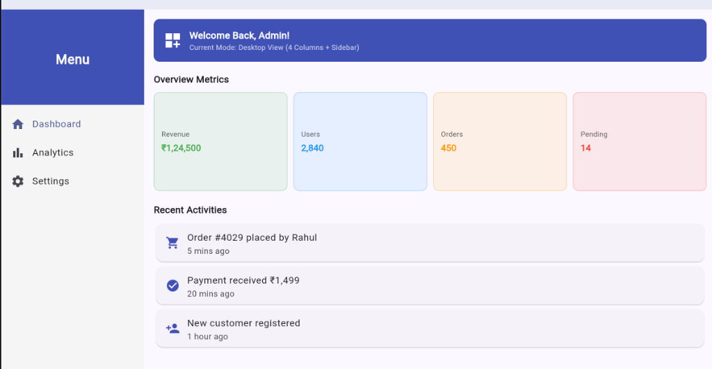

# Responsive Dashboard UI

A clean, responsive, and adaptive multi-section dashboard application built using **Flutter**.

**Course:** Mobile Application Development  
**Assignment 4:** Responsive Dashboard UI (10 Points)  
**Instructor:** Poonam Suresh Khanvilkar (Assistant Professor - Computer Science, Kharghar)  

---

## 📸 Output Preview



---

## 🌟 Key Features & Concepts Implemented

This project strictly implements the core Flutter layout widgets required by the assignment guidelines:

1. **`MediaQuery` (Viewport Adaptation)**
   - Determines runtime device width (`MediaQuery.of(context).size.width`).
   - Automatically shifts between **Desktop View** (permanent left sidebar, 4-column metric grid) and **Mobile View** (slide-out `Drawer` menu, 2-column metric grid).

2. **`Expanded` (Proportional Space Sharing)**
   - In desktop mode, a top-level `Row` divides screen space proportionately:
     - `Expanded(flex: 2)`: Allocates 20% of horizontal space for the navigation sidebar.
     - `Expanded(flex: 8)`: Allocates 80% of horizontal space for the main dashboard content.

3. **`Flexible` (Elastic Text & Overflow Prevention)**
   - Used inside the welcome banner `Row` to allow the greeting title and subtitle to flex and wrap gracefully without triggering `RenderFlex` pixel overflow errors.

4. **`GridView` (Responsive 2D Metric Cards)**
   - Displays real-time statistics (`Revenue`, `Users`, `Orders`, `Pending`).
   - Uses `GridView.count` with dynamic `crossAxisCount`:
     - **4 Columns** on desktop and widescreen monitors.
     - **2 Columns** on mobile and narrow viewports.

5. **`ListView` (Scrollable Vertical Feeds)**
   - Renders the recent activities list and the navigation drawer items cleanly with `shrinkWrap: true` and integrated scroll management.

---

## 📁 Project Structure

```text
lib/
├── main.dart             # Application entry point, Material 3 theming & app configuration
└── dashboard_screen.dart # Responsive dashboard layout, sidebar, metric grid, and activities
screenshots/
└── dashboard_desktop.png # Captured output screenshot
```

---

## 🚀 How to Run the Project

1. **Clone the repository:**
   ```bash
   git clone https://github.com/Ashurai84/EMBatchAssignments.git
   cd EMBatchAssignments
   git checkout responsive-dashboard-assignment
   ```

2. **Install dependencies:**
   ```bash
   flutter pub get
   ```

3. **Run on Chrome / Desktop / Emulator:**
   ```bash
   flutter run
   ```

4. **Run Tests & Static Analysis:**
   ```bash
   flutter test      # Verifies all widgets render successfully
   flutter analyze   # 0 warnings, 100% clean code
   ```

---

## 👨‍💻 Author
- **Student:** Ashutosh Rai
- **Repository:** [Ashurai84/EMBatchAssignments](https://github.com/Ashurai84/EMBatchAssignments)
- **Branch:** [`responsive-dashboard-assignment`](https://github.com/Ashurai84/EMBatchAssignments/tree/responsive-dashboard-assignment)
